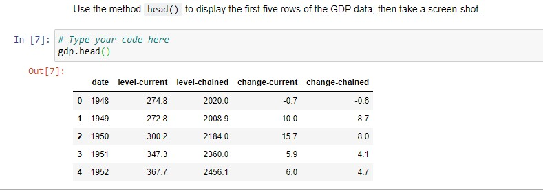
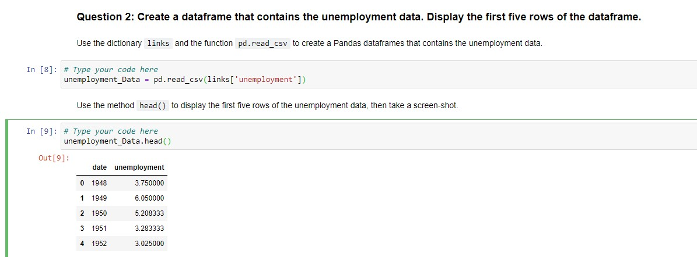
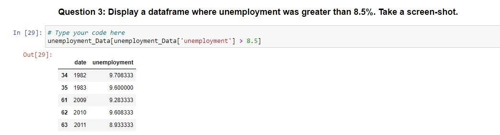
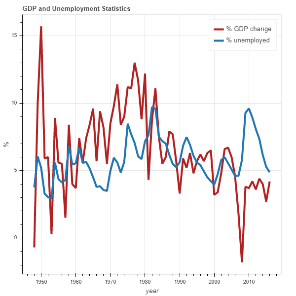

# Analyzing US Economic Data and Building a Dashboard

## Key Concepts
- Create a dashboard that shows key economic indicators from a specific data set.

__1. Create a dataframe that contains the GDP data and display using the method head() and take a screen shot__

  

__2.Create a dataframe that contains the unemployment data. Display the first five rows of the dataframe using the method head() and take a screen shot.__

  

__3.Display a dataframe where unemployment was greater than 8.5% . Take a screenshot__

  

__4.Use the function make_dashboard to make a dashboard, then take a screen shot.__

  

